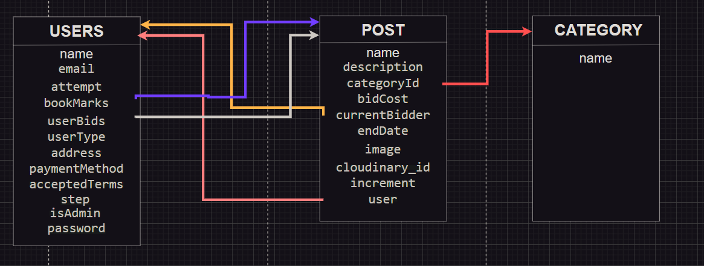
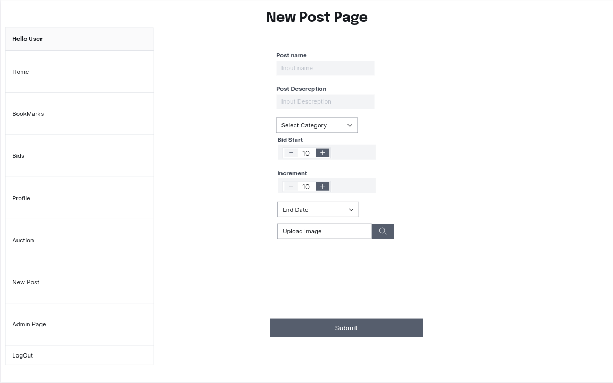
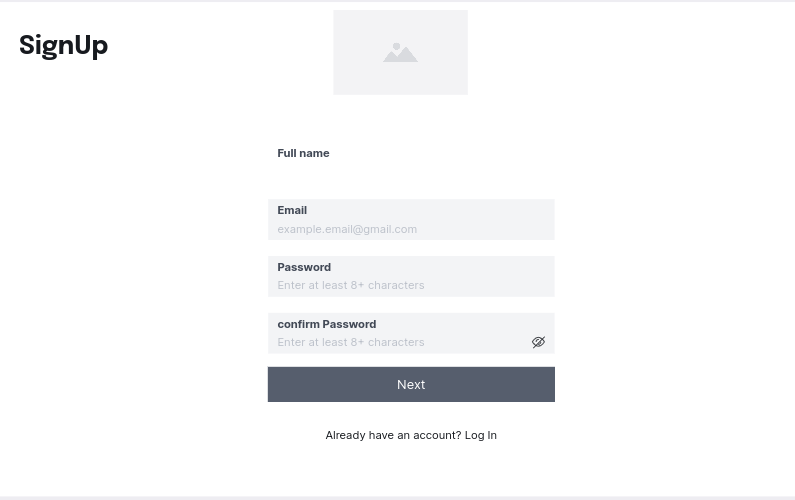
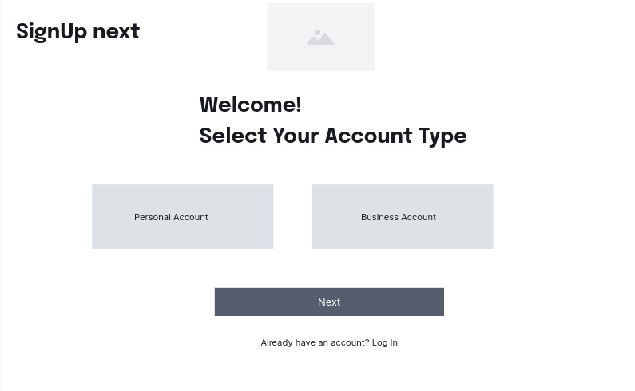
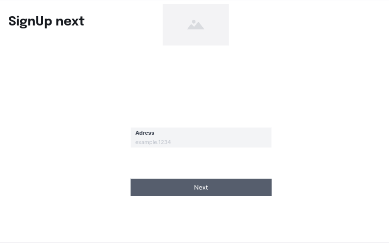
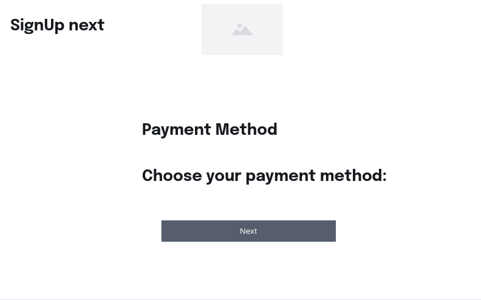
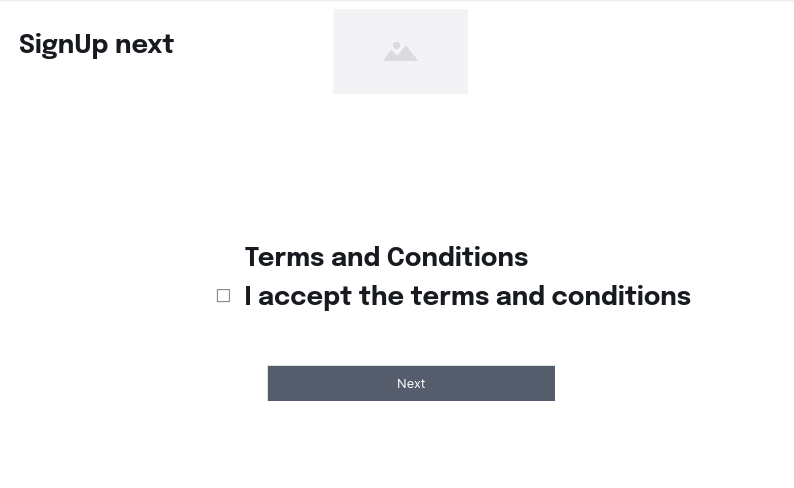

# Splendours Timeless Treasures

## Table of Contents

- [Project Overview](#project-overview)
- [Installation](#installation)
- [Usage](#usage)
- [Contributing](#contributing)
- [User Stories](#user-stories)
- [Future Work](#future-work)

## Project Overview

SPLENDOURS is a full-stack, single-page application that allows users to participate in online auctions. It provides a platform for regular users to browse auctioned items, place bids, and receive the won items. Business account users can post new auction items, upload images, and set auction durations to showcase their products and engage potential buyers. Admin users have complete authorization and oversight over the platform, including monitoring user activities, verifying transactions, banning users if necessary, managing categories, and ensuring smooth operations of the app.

## Installation

`npm i`
`npm i node-cron`
`npm i mongoose`
`npm i dotenv`
`npm i cloudinary`
`npm install @mui/material @mui/styled-engine-sc styled-components @mui/icons-material`

## Usage

- MongoDB/Mongoose: Database for storing user information, auction items, bids, and reviews.
- Express: Backend framework for handling server-side logic and API routes.
- React: Frontend library for building interactive user interfaces.
- Node.js: Server-side runtime environment.
- JWT (JSON Web Tokens): Authentication mechanism for user login and authorization.
- CSS: Styling the frontend components.
- Node-cron: Automatic scheduled script runner

## Contributing

User stories

## User Stories

1. Regular User:
   As a regular user of the bidding app, I want to be able to scroll through pictures of auctioned items, so I can easily see what's up for bid. I also want the ability to place bids on items that interest me and write reviews about items I've won in auctions. Being able to interact with the app's features easily and leave feedback on my transactions is important to me.

2. Business Account User:
   As a business account user on the bidding app, I need to be able to post new auction items, including uploading images and setting auction durations. This way, I can showcase the items my business is offering and create engaging auctions for potential buyers. It's essential that I have control over the process to ensure the success of my auctions and reach a wider audience.

3. Admin User;
   As an admin of the bidding app, I require complete authorisation and oversight over the platform. I need the ability to monitor user activities, verify successful transactions, and ensure that users are adhering to the rules. If I come across any suspicious or fraudulent activities, I need the authority to ban users to maintain a safe and secure environment. Additionally, I should be able to manage categories, delete accounts when necessary, and have access to tools that facilitate smooth operations of the platform. This comprehensive control will enable me to keep the app running smoothly and create a trustworthy user experience.

## ERDS

## User Home Page

## Business Home Page

## Admin Home Page

## BookMark Page

## Bids Page

## Edit Profile Page

## New Post Page

## Admin Add Form Page

## Admin Delete forms Page

## Login Page

## SignUp1 Page

## SignUp2 Page

## SignUp3 Page

## SignUp4 Page

## SignUp5 Page

## Reset Password Page

## Future Work

- Implement real-time updates for bidding and auction countdowns using WebSocket or a similar technology.
- Improve the user interface and add more interactive features.
- Enhance the search functionality to allow users to find specific auction items.
- Implement email notifications for bid updates, auction results, and account activities.
- Integrate payment gateways for secure and seamless transactions.
- Expand the admin's tools and analytics to gain insights into user behavior and auction performance.
- Implement social media sharing options to promote auctions and increase user engagement.
